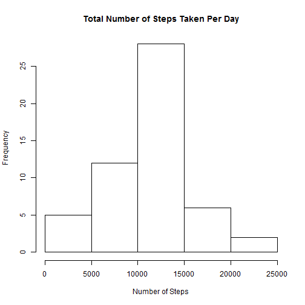
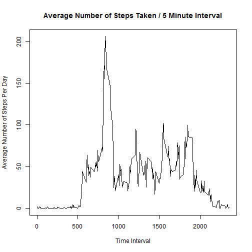
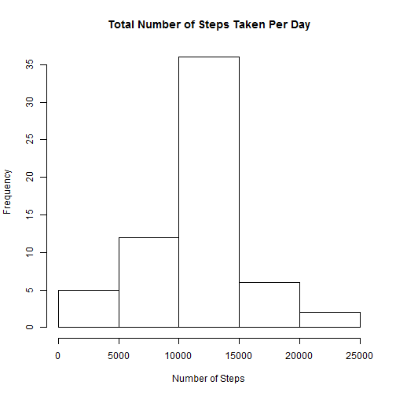
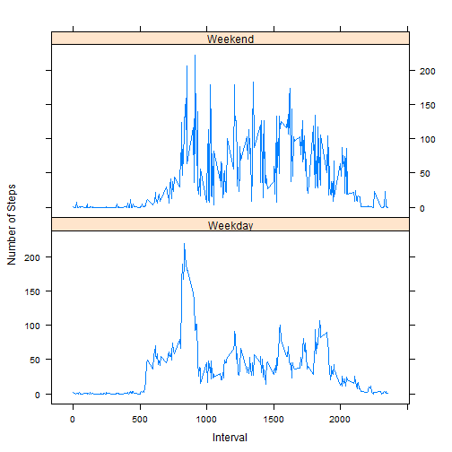

This assignment will analyze the number of steps taken in a 5 minute interval 
for two months (October & November) in 2012. 

**Loading and preprocessing the data**

*Load the data (i.e. read.csv())*

The data is contained in a file called activity.csv


```r
rawData <- read.csv("./activity.csv")
```

*Process/transform the data (if necessary) into a format suitable for your analysis*

For the purpose of this assignment, the pre-processing needed is to change
the date variable into a date object.


```r
rawData$date <- as.Date(rawData$date, format="%Y-%m-%d")
```

**What is mean total number of steps taken per day?**

*Calculate the total number of steps taken per day*

The first step is to identify how many steps were taken in each day and 
rename the columns:


```r
library(plyr)
histData <- aggregate(rawData$steps, by = list(rawData$date), FUN = sum)
histData <- rename(histData, replace = c("Group.1" = "Date", "x" = "SumOfSteps"))
histData
```

```
##          Date SumOfSteps
## 1  2012-10-01         NA
## 2  2012-10-02        126
## 3  2012-10-03      11352
## 4  2012-10-04      12116
## 5  2012-10-05      13294
## 6  2012-10-06      15420
## 7  2012-10-07      11015
## 8  2012-10-08         NA
## 9  2012-10-09      12811
## 10 2012-10-10       9900
## 11 2012-10-11      10304
## 12 2012-10-12      17382
## 13 2012-10-13      12426
## 14 2012-10-14      15098
## 15 2012-10-15      10139
## 16 2012-10-16      15084
## 17 2012-10-17      13452
## 18 2012-10-18      10056
## 19 2012-10-19      11829
## 20 2012-10-20      10395
## 21 2012-10-21       8821
## 22 2012-10-22      13460
## 23 2012-10-23       8918
## 24 2012-10-24       8355
## 25 2012-10-25       2492
## 26 2012-10-26       6778
## 27 2012-10-27      10119
## 28 2012-10-28      11458
## 29 2012-10-29       5018
## 30 2012-10-30       9819
## 31 2012-10-31      15414
## 32 2012-11-01         NA
## 33 2012-11-02      10600
## 34 2012-11-03      10571
## 35 2012-11-04         NA
## 36 2012-11-05      10439
## 37 2012-11-06       8334
## 38 2012-11-07      12883
## 39 2012-11-08       3219
## 40 2012-11-09         NA
## 41 2012-11-10         NA
## 42 2012-11-11      12608
## 43 2012-11-12      10765
## 44 2012-11-13       7336
## 45 2012-11-14         NA
## 46 2012-11-15         41
## 47 2012-11-16       5441
## 48 2012-11-17      14339
## 49 2012-11-18      15110
## 50 2012-11-19       8841
## 51 2012-11-20       4472
## 52 2012-11-21      12787
## 53 2012-11-22      20427
## 54 2012-11-23      21194
## 55 2012-11-24      14478
## 56 2012-11-25      11834
## 57 2012-11-26      11162
## 58 2012-11-27      13646
## 59 2012-11-28      10183
## 60 2012-11-29       7047
## 61 2012-11-30         NA
```

*Make a histogram of the total number of steps taken each day*


```r
hist(histData$SumOfSteps,
     main = "Total Number of Steps Taken Per Day", 
     xlab = "Number of Steps")
```

 

*Calculate and report the mean and median of the total number of steps taken per day*

The mean number of steps taken per day is:


```r
mean(histData$SumOfSteps, na.rm = TRUE)
```

```
## [1] 10766.19
```

The median number of steps taken per day is:


```r
median(histData$SumOfSteps, na.rm = TRUE)
```

```
## [1] 10765
```

**What is the average daily activity pattern?**

*Make a time series plot (i.e. type = "l") of the 5-minute interval (x-axis) and the average number of steps taken, averaged across all days (y-axis)*


```r
timeSeries <- aggregate(rawData$steps, by = list(rawData$interval), FUN = mean, na.rm = TRUE)
timeSeries <- rename(timeSeries, replace = c("Group.1" = "Interval", "x" = "MeanOfSteps"))
plot(timeSeries$Interval, 
     timeSeries$MeanOfSteps, 
     type = "l",
     ylab = "Average Number of Steps Per Day",
     xlab = "Time Interval",
     main = "Average Number of Steps Taken / 5 Minute Interval")
```

 

*Which 5-minute interval, on average across all the days in the dataset, contains the maximum number of steps?*

Across all intervals, the time with the highest mean is:


```r
timeSeries[which(timeSeries$MeanOfSteps == max(timeSeries$MeanOfSteps)),]
```

```
##     Interval MeanOfSteps
## 104      835    206.1698
```

**Imputing missing values**

*Calculate and report the total number of missing values in the dataset (i.e. the total number of rows with NAs)*

The total number of rows in the dataset is:


```r
sum(is.na(rawData$steps))
```

```
## [1] 2304
```

*Devise a strategy for filling in all of the missing values in the dataset. The strategy does not need to be sophisticated.*

Let us replace all missing values with the mean for that 5-minute interval.

*Create a new dataset that is equal to the original dataset but with the missing data filled in.*


```r
replacedData <- rawData

for(i in 1:length(replacedData$steps)) { # look at each value in steps
     if (is.na(replacedData$steps[i])) { # check if the value is NA
          replacedData$steps[i] <- timeSeries[which(timeSeries$Interval == replacedData$interval[i]),
                                              "MeanOfSteps"] 
          
          # If statement is replacing the value of the steps with the same value of the interval
          # in the time-series dataframe that calculated the average of each interval after
          # removing the NA's
     }
}
```

To confirm that we have done the replacement correctly, let's check for the
number of NA's remaining and the top 6 rows which were NA in the rawData set 
and have values in the replacedData set.


```r
sum(is.na(replacedData$steps))
```

```
## [1] 0
```

```r
head(replacedData)
```

```
##       steps       date interval
## 1 1.7169811 2012-10-01        0
## 2 0.3396226 2012-10-01        5
## 3 0.1320755 2012-10-01       10
## 4 0.1509434 2012-10-01       15
## 5 0.0754717 2012-10-01       20
## 6 2.0943396 2012-10-01       25
```

*Make a histogram of the total number of steps taken each day and Calculate and report the mean and median total number of steps taken per day. Do these values differ from the estimates from the first part of the assignment? What is the impact of imputing missing data on the estimates of the total daily number of steps?*

Make a histogram of the total number of steps taken each day:


```r
library(plyr)
histDataReplaced <- aggregate(replacedData$steps, by = list(replacedData$date), FUN = sum)
histDataReplaced <- rename(histDataReplaced, replace = c("Group.1" = "Date", "x" = "SumOfSteps"))

histDataReplaced
```

```
##          Date SumOfSteps
## 1  2012-10-01   10766.19
## 2  2012-10-02     126.00
## 3  2012-10-03   11352.00
## 4  2012-10-04   12116.00
## 5  2012-10-05   13294.00
## 6  2012-10-06   15420.00
## 7  2012-10-07   11015.00
## 8  2012-10-08   10766.19
## 9  2012-10-09   12811.00
## 10 2012-10-10    9900.00
## 11 2012-10-11   10304.00
## 12 2012-10-12   17382.00
## 13 2012-10-13   12426.00
## 14 2012-10-14   15098.00
## 15 2012-10-15   10139.00
## 16 2012-10-16   15084.00
## 17 2012-10-17   13452.00
## 18 2012-10-18   10056.00
## 19 2012-10-19   11829.00
## 20 2012-10-20   10395.00
## 21 2012-10-21    8821.00
## 22 2012-10-22   13460.00
## 23 2012-10-23    8918.00
## 24 2012-10-24    8355.00
## 25 2012-10-25    2492.00
## 26 2012-10-26    6778.00
## 27 2012-10-27   10119.00
## 28 2012-10-28   11458.00
## 29 2012-10-29    5018.00
## 30 2012-10-30    9819.00
## 31 2012-10-31   15414.00
## 32 2012-11-01   10766.19
## 33 2012-11-02   10600.00
## 34 2012-11-03   10571.00
## 35 2012-11-04   10766.19
## 36 2012-11-05   10439.00
## 37 2012-11-06    8334.00
## 38 2012-11-07   12883.00
## 39 2012-11-08    3219.00
## 40 2012-11-09   10766.19
## 41 2012-11-10   10766.19
## 42 2012-11-11   12608.00
## 43 2012-11-12   10765.00
## 44 2012-11-13    7336.00
## 45 2012-11-14   10766.19
## 46 2012-11-15      41.00
## 47 2012-11-16    5441.00
## 48 2012-11-17   14339.00
## 49 2012-11-18   15110.00
## 50 2012-11-19    8841.00
## 51 2012-11-20    4472.00
## 52 2012-11-21   12787.00
## 53 2012-11-22   20427.00
## 54 2012-11-23   21194.00
## 55 2012-11-24   14478.00
## 56 2012-11-25   11834.00
## 57 2012-11-26   11162.00
## 58 2012-11-27   13646.00
## 59 2012-11-28   10183.00
## 60 2012-11-29    7047.00
## 61 2012-11-30   10766.19
```

```r
hist(histDataReplaced$SumOfSteps,
     main = "Total Number of Steps Taken Per Day", 
     xlab = "Number of Steps")
```

 

The mean number of steps taken per day:


```r
mean(histDataReplaced$SumOfSteps)
```

```
## [1] 10766.19
```

The median total number of steps taken per day:


```r
median(histDataReplaced$SumOfSteps)
```

```
## [1] 10766.19
```

I was surprised that the mean and median were the same, so I double checked it through Excel.

*Do these values differ from the estimates from the first part of the assignment?*


```r
cat("Mean With Missing Values: ", mean(histData$SumOfSteps, na.rm = TRUE))
```

```
## Mean With Missing Values:  10766.19
```

```r
cat("Mean Without Missing Values: ", mean(histDataReplaced$SumOfSteps))
```

```
## Mean Without Missing Values:  10766.19
```

The mean does not differ


```r
cat("Median with missing values: ", median(histData$SumOfSteps, na.rm = TRUE))
```

```
## Median with missing values:  10765
```

```r
cat("Median without missing values: ", median(histDataReplaced$SumOfSteps))
```

```
## Median without missing values:  10766.19
```

The median has increased.

*What is the impact of imputing missing data on the estimates of the total daily number of steps?*

There is very little impact. The mean is the same and median has increased but not by a large margin.

**Are there differences in activity patterns between weekdays and weekends?**

*Create a new factor variable in the dataset with two levels - "weekday" and "weekend" indicating whether a given date is a weekday or weekend day.*


```r
dayData <- replacedData

dayData$dayType <- ifelse(weekdays(dayData$date) == c("Saturday", "Sunday"), "Weekend", "Weekday")
```

*Make a panel plot containing a time series plot (i.e. type = "l") of the 5-minute interval (x-axis) and the average number of steps taken, averaged across all weekday days or weekend days (y-axis)*


```r
library(lattice)

timeSeriesReplaced <- aggregate(dayData$steps, by = list(dayData$interval, dayData$dayType), FUN = mean)
timeSeriesReplaced <- rename(timeSeriesReplaced, replace = c("Group.1" = "Interval", 
                                                             "x" = "MeanOfSteps",
                                                             "Group.2" = "DayType"))

xyplot(MeanOfSteps ~ Interval | DayType, 
       data = timeSeriesReplaced, 
       layout=c(1,2),
       ylab = "Number of Steps",
       type = "l")
```

 
